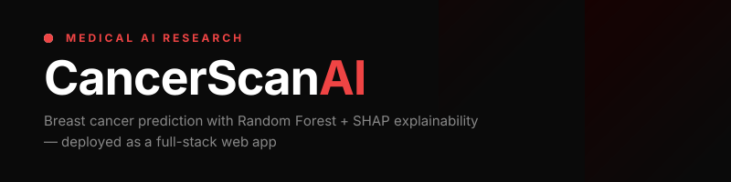
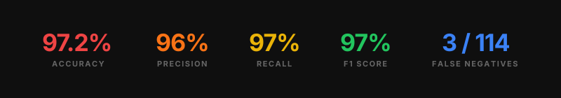
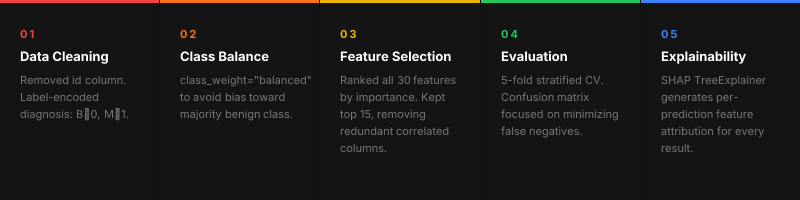
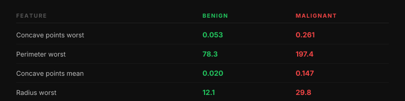

**[Live Demo](https://cancer-app-p6wz.onrender.com/app)** · **[Kaggle Notebook](https://www.kaggle.com/aliiakbarkhan)** · **[Dataset](https://www.kaggle.com/datasets/yasserh/breast-cancer-dataset)**

***

## What it does

Takes 5 tumor measurements as input and predicts whether a tumor is benign or malignant — then explains *why* using SHAP feature attribution, so the prediction is never just a black box.

***

## Results



Evaluated using **5-fold stratified cross-validation**, not a single train/test split.

***

## Stack


***

## Project structure

```
cancer-app/
├── main.py               # FastAPI backend — /predict and /features endpoints
├── index.html            # Frontend — sliders, results, SHAP bar chart
├── model.pkl             # Trained Random Forest model
├── X_train.pkl           # Training data for SHAP background
├── feature_names.json    # Top 5 + all 15 feature names
├── requirements.txt      # Python dependencies
└── notebook/
    └── breast-cancer-prediction.ipynb
```

***

## ML approach



***

## API

**`GET /features`** — returns min, max, and mean values for the top 5 features (used to populate slider ranges in the frontend).

**`POST /predict`**

```json
{
  "inputs": {
    "concave points_worst": 0.14,
    "perimeter_worst": 120.0,
    "concave points_mean": 0.07,
    "radius_worst": 16.0,
    "area_worst": 900.0
  }
}
```

Returns:

```json
{
  "prediction": 1,
  "label": "Malignant",
  "confidence": 94.2,
  "shap_values": [...],
  "shap_base": 0.37
}
```

***

## Run locally

```bash
git clone https://github.com/aliiakbarkhan/cancer-app.git
cd cancer-app
pip install -r requirements.txt
uvicorn main:app --reload
```

Then open `http://localhost:8000/app`

***

## Test cases



***

## Disclaimer

This tool is for **research and educational purposes only**. It is not a substitute for professional medical diagnosis.

***

[](https://github.com/aliiakbarkhan)
